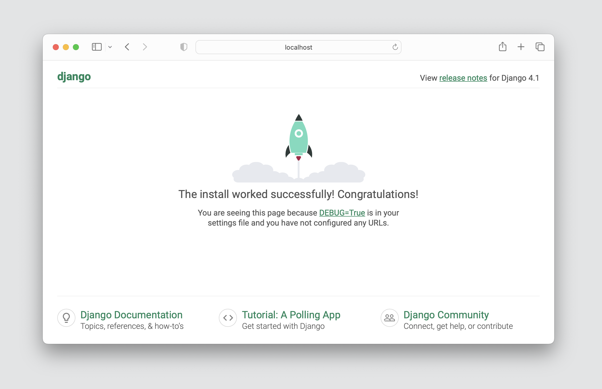
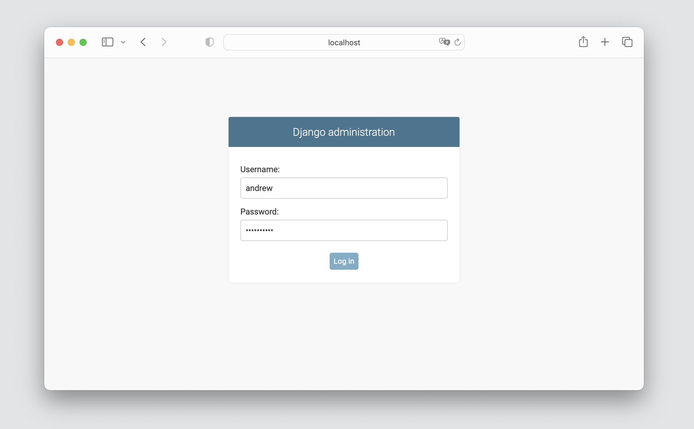

# Day 0 - Set up your Computer

### Download the required software

- Git - [git-scm.com/downloads](https://git-scm.com/downloads)
- Visual Studio Code - [code.visualstudio.com](https://code.visualstudio.com/)
- Google Chrome - [google.com/chrome](https://www.google.com/chrome/)
- *If you are using Windows*, install Python from the Windows store
- In a terminal window (command prompt if you are using windows), enter following commands to download the project to your `Desktop` folder:

```bash
cd ~/Desktop
git clone https://github.com/andrewrobles/MyApp.git
```

### Create a Virtual Environment

Determine whether you are using a Mac or Windows computer, then do the following based on whichever category you fall into

If you are using Mac:

```bash
python3 -m venv venv
source venv/bin/activate
```

If you are using Windows:

```bash
python -m venv venv
venv\Scripts\activate
```

### Run the App

Enter the following commands into your terminal window:

```bash
pip install -r requirements.txt
python manage.py migrate
python manage.py runserver
```

Open the `http://localhost:8000` in Google Chrome. You should see the following:



### Create an account and log in

Initiate account creation process `python manage.py createsuperuser` and provide account credentials

```bash
Username: andrew
Email address: me@andrewrobles.com
Password: **********
Password (again): *********
Superuser created successfully.
```

With the server running, open `http://localhost:8000/admin` and login using the username and password you entered in the previous step.

