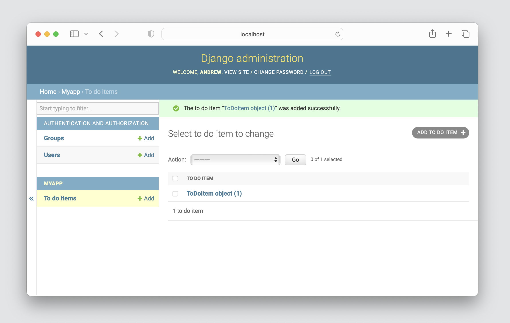
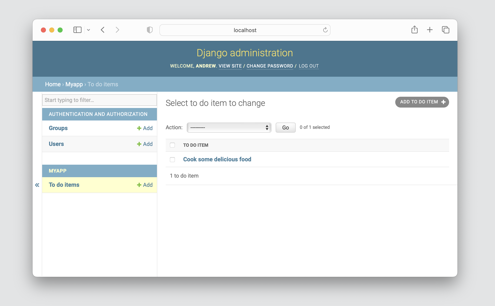
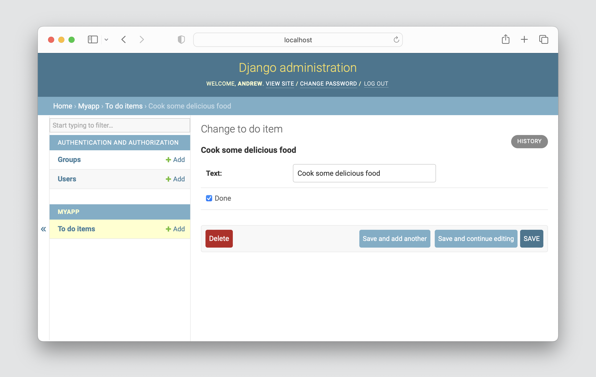
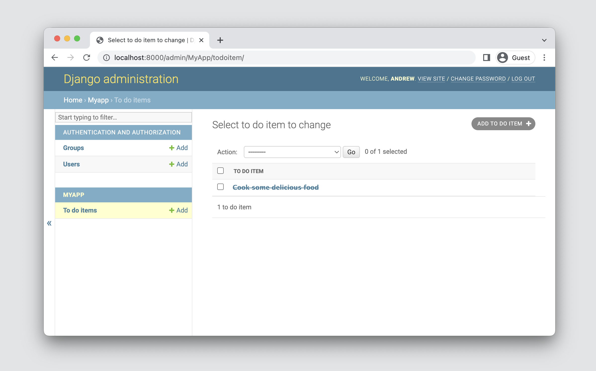

# Day 1 - Make a Database

- Open the `MyApp` project in Visual Studio Code
- Enable auto save by going to `File > Auto Save`
- Copy the following code to `models.py`

```python
from django.db import models

class ToDoItem(models.Model):
    text = models.CharField(max_length=200)
    done = models.BooleanField(default=False)
```

- Open a terminal window by going to `Terminal > New Terminal`
- Run the following commands

```bash
python manage.py makemigrations
python manage.py migrate
```

Copy the following code to `admin.py`

```python
from django.contrib import admin

from .models import ToDoItem

admin.site.register(ToDoItem)
```

Use the admin website to create some todo items then observe the result



What a minute.  `ToDoItem object (1)` isn’t a helpful representation of this object. Let’s fix that by editing the  `ToDoItem` model and adding a `__str__` function to `models.py`

```python
from django.db import models

class ToDoItem(models.Model):
    text = models.CharField(max_length=200)
    done = models.BooleanField(default=False)

    def __str__(self):
        return self.text
```

You should see something like the following



### Customize How Text is Displayed

Using the app, edit the to-do item and click on the checkbox to mark it as done.



Now, we are going to write some code so that any items marked as done are crossed out. Let’s update the contents of `MyApp/models.py` to:

```python
from django.db import models
from .utils import strike

class TodoItem(models.Model):
    text = models.CharField(max_length=200)
    done = models.BooleanField(default=False)

    def __str__(self):
        if self.done == True:
            return strike(self.text)
        else:
            return self.text
```

If you go back to your list of to-do items, you should see your item crossed out because it was marked as done.


