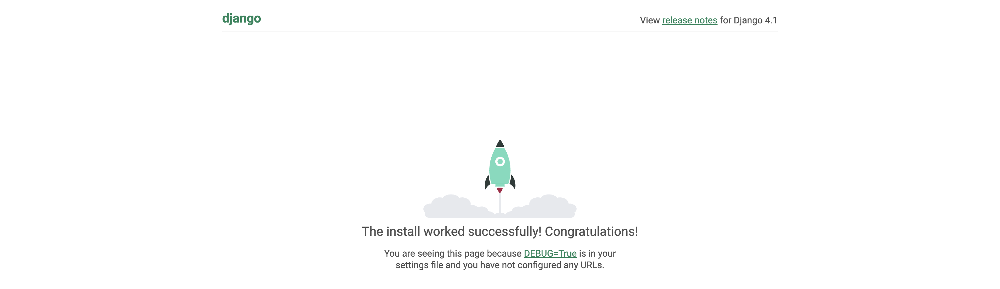
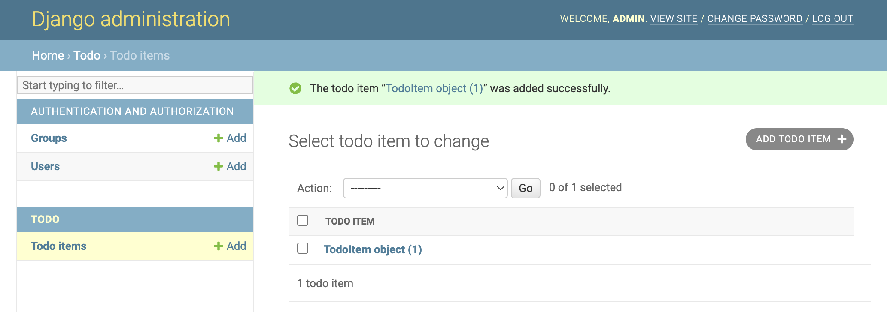
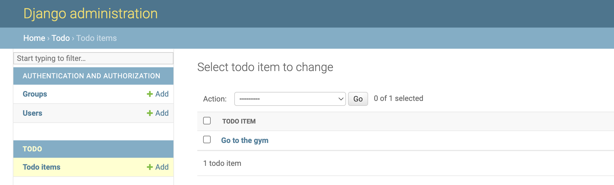

# DAY 1 - LOG INTO THE DATABASE

## Introduction

This workshop will walk you through building a to-do list app that does the following:

- Creates a to-do item
- Edits to-do item text
- Marks a to-do item as completed
- Deletes a to-do item

# STEP 1 - SET UP YOUR COMPUTER FOR BUILDING APPS
Download and install the following:

- **Git** - [git-scm.com/downloads](https://git-scm.com/downloads)
- **Visual Studio Code** - [code.visualstudio.com](https://code.visualstudio.com)

### ONLY if you are using Windows:

- Install **Python** from the Windows store

---

### Enable Auto Save

In order to prevent you from having to manually save the files every time you make a change, let's enable Auto Save so your changes will be saved automagically.

- Open Visual Studio Code
- Enable auto save by going to `File > Auto Save`


# Run Your App for the First Time 

In a terminal window, run the following commands to download the project to your `Desktop` folder:

  ```bash
  cd ~/Desktop
  git clone https://github.com/andrewrobles/MyApp.git
  ```

- Open up the project in Visual Studio Code by going to `File > Open` and navigating to `~/Desktop/MyApp`
- Open up a terminal window by going to `View > Terminal`
- Depending on if you're using Mac or Windows, run the following command under the section of whichever type of computer you're using:
---

### If you are using a Mac:
```bash
python3 -m venv VirtualEnvironment 
```

### If you are using Windows:
```bash
python -m venv VirtualEnvironment 
```
---
- Run the following commands:
```bash
source VirtualEnvironment/bin/activate
pip install -r requirements.txt
python manage.py migrate
```
- Now this is where the magic happens... are you ready? Run the following command:
```bash
python manage.py runserver
```
- Open the URL in a browser window provided in the terminal output - http://127.0.0.1:8000
- You should see the following:
  

Congratulations, you're officially an app developer ;)

# Step 2 - Create An Account and Log In

Run the following command to create an account
```bash
python manage.py createsuperuser
```

Enter a username and press Enter
```
Username: andrew
```

You will then be prompted for your desired email address
```
Email address: me@andrewrobles.com
```

The final step is to enter your password. You will be asked to enter your password twice, the second time as a confirmation of the first.
```
Password: **********
Password (again): *********
Superuser created successfully.
```

With the server running, open `http://127.0.0.1:8000/admin` and login using the username and password you entered in the previous step.

# Step 3 - Store Information In App Database

Let's open the `MyApp/models.py` file in the code editor, remove everything from it, and write code like this:

```python
from django.db import models

class ToDoItem(models.Model):
    text = models.CharField(max_length=200)
    done = models.BooleanField(default=False)
```

In a separate terminal window from where you ran the `python manage.py runserver` command, run the following commands to start a virtual environment then tell your app that you've made changes to what your database should look like:

```bash
source VirtualEnvironment/bin/activate
python manage.py makemigrations
```

You should see something like this:

```
Migrations for 'todo':
  todo/migrations/0001_initial.py
    - Create model TodoItem
```

Now, run the following command to make those changes in the database:

```bash
python manage.py migrate
```

You should see something similar to the following:

```
Operations to perform:
  Apply all migrations: admin, auth, contenttypes, todo, sessions
Running migrations:
  Rendering model states... DONE
  Applying todo.0001_initial... OK
```

### Using the app

Add the following code to `MyApp/admin.py`
```python
from django.contrib import admin

from .models import TodoItem

admin.site.register(TodoItem)
```
- Use the app to create a few to-do items! Examples of some good ones are "Cook some delicious food", and "Eat some delicious food"
- You should now see the following:



Wait a minute. `<TodoItem: TodoItem object (1)>` isn’t a helpful representation of this object. Let’s fix that by editing the `TodoItem` model (in the `MyApp/models.py` file) and adding a `__str__()` method to `TodoItem`:

```python
from django.db import models

class TodoItem(models.Model):
    # ...
    def __str__(self):
        return self.text
```

It’s important to add `__str__()` methods to your models for your own convenience so it's easier to tell what object you're looking at.

You should see your to-do item change from `<TodoItem: TodoItem object (1)>` to `Go to the gym` in your list of to-do items:



# Step 4 - Customize How Text is Displayed

Using the app, edit the to-do item and click on the checkbox to mark it as done.


Now, we are going to write some code so that any items marked as done are crossed out. Let’s update the contents of `MyApp/models.py` to:

```python
from django.db import models
from .utils import strike

class TodoItem(models.Model):
    text = models.CharField(max_length=200)
    done = models.BooleanField(default=False)

    def __str__(self):
        if self.done == True:
            return strike(self.text)
        else:
            return self.text
```

If you go back to your list of to-do items, you should see your item crossed out because it was marked as done.

