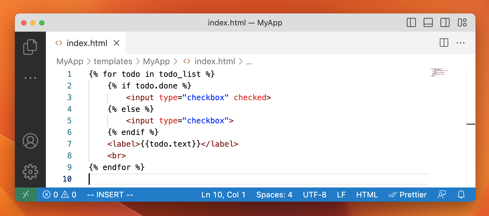
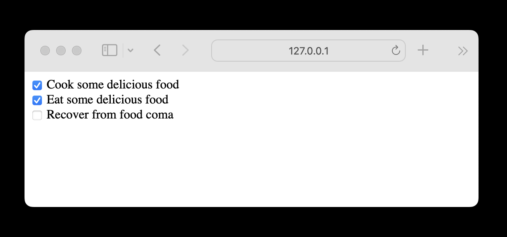

# Day 2 - Render a Webpage

Create a new directory inside the `MyApp` directory called `templates`. Inside of `templates`, create a new directory called `MyApp`. Inside of this new `MyApp` directory, create a file called `index.html` containing the following code:



Open the file called `views.py` and copy over the following code:

```python
from django.shortcuts import render
from MyApp.models import ToDoItem

def index(request):
    context = {
        'todo_list': ToDoItem.objects.all()
    }

    return render(request, 'MyApp/index.html', context)
```

Create a new file inside `MyApp` called `urls.py` containing the following code:

```python
from django.urls import path

from . import views

urlpatterns = [
    path('', views.index, name='index'),
]
```

Open the file called `urls.py` inside the `projects` directory and edit the code to look like:

```python
from django.contrib import admin
from django.urls import path, include

urlpatterns = [
    path('', include('MyApp.urls')),
    path('admin/', admin.site.urls),
]
```

Open [http://127.0.0.1:8000](http://127.0.0.1:8000/) in a browser to see your rendered webpage!

