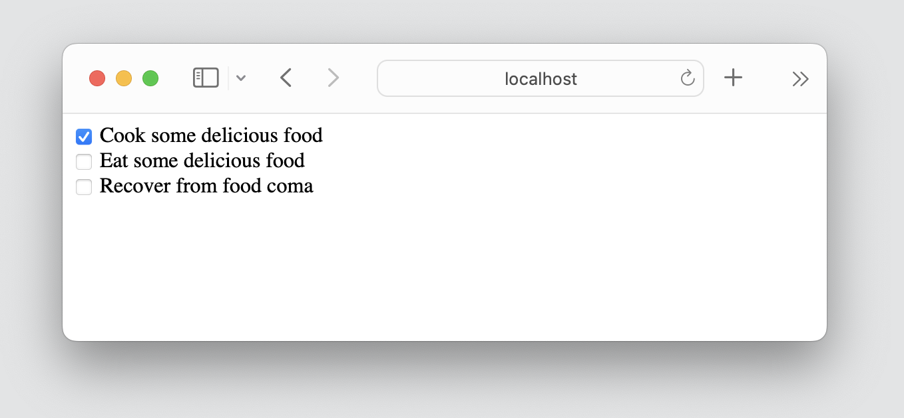
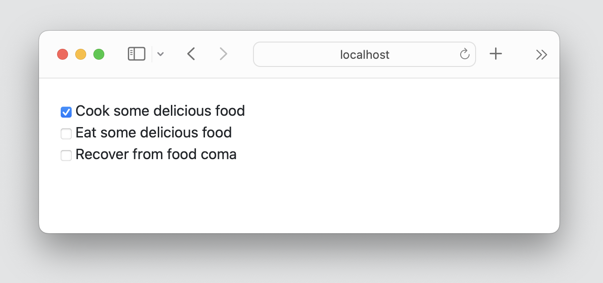

# Day 3 - Add User Actions

Edit the `views.py` file to look like this: 

```python
from django.shortcuts import render, redirect

from MyApp.models import ToDoItem

def index(request):
    context = {
        'todo_list': ToDoItem.objects.all()
    }
    return render(request, 'MyApp/index.html', context)

def do(request, id):
    todo = ToDoItem.objects.get(id=id)
    todo.done = True
    todo.save()
    return redirect('/')

def undo(request, id):
    todo = ToDoItem.objects.get(id=id)
    todo.done = False 
    todo.save()
    return redirect('/')
```

Edit the `MyApp/urls.py` to look like this:

```python
from django.urls import path

from . import views

urlpatterns = [
    path('', views.index, name='index'),
    path('<int:id>/do/', views.do, name='do'),
    path('<int:id>/undo/', views.undo, name='undo'),
]
```

Edit the `index.html` file to look like this:

<pre>
&#x3c;&#x6c;&#x69;&#x6e;&#x6b;&#x20;&#x68;&#x72;&#x65;&#x66;&#x3d;&#x22;&#x68;&#x74;&#x74;&#x70;&#x73;&#x3a;&#x2f;&#x2f;&#x63;&#x64;&#x6e;&#x2e;&#x6a;&#x73;&#x64;&#x65;&#x6c;&#x69;&#x76;&#x72;&#x2e;&#x6e;&#x65;&#x74;&#x2f;&#x6e;&#x70;&#x6d;&#x2f;&#x62;&#x6f;&#x6f;&#x74;&#x73;&#x74;&#x72;&#x61;&#x70;&#x40;&#x35;&#x2e;&#x33;&#x2e;&#x30;&#x2d;&#x61;&#x6c;&#x70;&#x68;&#x61;&#x33;&#x2f;&#x64;&#x69;&#x73;&#x74;&#x2f;&#x63;&#x73;&#x73;&#x2f;&#x62;&#x6f;&#x6f;&#x74;&#x73;&#x74;&#x72;&#x61;&#x70;&#x2e;&#x6d;&#x69;&#x6e;&#x2e;&#x63;&#x73;&#x73;&#x22;&#x20;&#x72;&#x65;&#x6c;&#x3d;&#x22;&#x73;&#x74;&#x79;&#x6c;&#x65;&#x73;&#x68;&#x65;&#x65;&#x74;&#x22;&#x20;&#x69;&#x6e;&#x74;&#x65;&#x67;&#x72;&#x69;&#x74;&#x79;&#x3d;&#x22;&#x73;&#x68;&#x61;&#x33;&#x38;&#x34;&#x2d;&#x4b;&#x4b;&#x39;&#x34;&#x43;&#x48;&#x46;&#x4c;&#x4c;&#x65;&#x2b;&#x6e;&#x59;&#x32;&#x64;&#x6d;&#x43;&#x57;&#x47;&#x4d;&#x71;&#x39;&#x31;&#x72;&#x43;&#x47;&#x61;&#x35;&#x67;&#x74;&#x55;&#x34;&#x6d;&#x6b;&#x39;&#x32;&#x48;&#x64;&#x76;&#x59;&#x65;&#x2b;&#x4d;&#x2f;&#x53;&#x58;&#x48;&#x33;&#x30;&#x31;&#x70;&#x35;&#x49;&#x4c;&#x79;&#x2b;&#x64;&#x4e;&#x39;&#x2b;&#x6e;&#x4a;&#x4f;&#x5a;&#x22;&#x20;&#x63;&#x72;&#x6f;&#x73;&#x73;&#x6f;&#x72;&#x69;&#x67;&#x69;&#x6e;&#x3d;&#x22;&#x61;&#x6e;&#x6f;&#x6e;&#x79;&#x6d;&#x6f;&#x75;&#x73;&#x22;&#x3e;&#xa;&#x3c;&#x64;&#x69;&#x76;&#x20;&#x63;&#x6c;&#x61;&#x73;&#x73;&#x3d;&#x22;&#x6d;&#x2d;&#x34;&#x22;&#x3e;&#xa;&#x20;&#x20;&#x20;&#x20;&#x7b;&#x25;&#x20;&#x66;&#x6f;&#x72;&#x20;&#x74;&#x6f;&#x64;&#x6f;&#x20;&#x69;&#x6e;&#x20;&#x74;&#x6f;&#x64;&#x6f;&#x5f;&#x6c;&#x69;&#x73;&#x74;&#x20;&#x25;&#x7d;&#xa;&#x20;&#x20;&#x20;&#x20;&#x20;&#x20;&#x20;&#x20;&#x7b;&#x25;&#x20;&#x69;&#x66;&#x20;&#x74;&#x6f;&#x64;&#x6f;&#x2e;&#x64;&#x6f;&#x6e;&#x65;&#x20;&#x25;&#x7d;&#xa;&#x20;&#x20;&#x20;&#x20;&#x20;&#x20;&#x20;&#x20;&#x20;&#x20;&#x20;&#x20;&#x3c;&#x69;&#x6e;&#x70;&#x75;&#x74;&#x20;&#x74;&#x79;&#x70;&#x65;&#x3d;&#x22;&#x63;&#x68;&#x65;&#x63;&#x6b;&#x62;&#x6f;&#x78;&#x22;&#x20;&#x63;&#x68;&#x65;&#x63;&#x6b;&#x65;&#x64;&#x20;&#x6f;&#x6e;&#x63;&#x6c;&#x69;&#x63;&#x6b;&#x3d;&#x22;&#x6c;&#x6f;&#x63;&#x61;&#x74;&#x69;&#x6f;&#x6e;&#x2e;&#x68;&#x72;&#x65;&#x66;&#x3d;&#x27;&#x2f;&#x7b;&#x7b;&#x20;&#x74;&#x6f;&#x64;&#x6f;&#x2e;&#x69;&#x64;&#x20;&#x7d;&#x7d;&#x2f;&#x75;&#x6e;&#x64;&#x6f;&#x27;&#x22;&#x3e;&#xa;&#x20;&#x20;&#x20;&#x20;&#x20;&#x20;&#x20;&#x20;&#x7b;&#x25;&#x20;&#x65;&#x6c;&#x73;&#x65;&#x20;&#x25;&#x7d;&#xa;&#x20;&#x20;&#x20;&#x20;&#x20;&#x20;&#x20;&#x20;&#x20;&#x20;&#x20;&#x20;&#x3c;&#x69;&#x6e;&#x70;&#x75;&#x74;&#x20;&#x74;&#x79;&#x70;&#x65;&#x3d;&#x22;&#x63;&#x68;&#x65;&#x63;&#x6b;&#x62;&#x6f;&#x78;&#x22;&#x20;&#x6f;&#x6e;&#x63;&#x6c;&#x69;&#x63;&#x6b;&#x3d;&#x22;&#x6c;&#x6f;&#x63;&#x61;&#x74;&#x69;&#x6f;&#x6e;&#x2e;&#x68;&#x72;&#x65;&#x66;&#x3d;&#x27;&#x2f;&#x7b;&#x7b;&#x20;&#x74;&#x6f;&#x64;&#x6f;&#x2e;&#x69;&#x64;&#x20;&#x7d;&#x7d;&#x2f;&#x64;&#x6f;&#x27;&#x22;&#x3e;&#xa;&#x20;&#x20;&#x20;&#x20;&#x20;&#x20;&#x20;&#x20;&#x7b;&#x25;&#x20;&#x65;&#x6e;&#x64;&#x69;&#x66;&#x20;&#x25;&#x7d;&#xa;&#x20;&#x20;&#x20;&#x20;&#x20;&#x20;&#x20;&#x20;&#x3c;&#x6c;&#x61;&#x62;&#x65;&#x6c;&#x3e;&#x7b;&#x7b;&#x74;&#x6f;&#x64;&#x6f;&#x2e;&#x74;&#x65;&#x78;&#x74;&#x7d;&#x7d;&#x3c;&#x2f;&#x6c;&#x61;&#x62;&#x65;&#x6c;&#x3e;&#xa;&#x20;&#x20;&#x20;&#x20;&#x20;&#x20;&#x20;&#x20;&#x3c;&#x62;&#x72;&#x3e;&#xa;&#x20;&#x20;&#x20;&#x20;&#x7b;&#x25;&#x20;&#x65;&#x6e;&#x64;&#x66;&#x6f;&#x72;&#x20;&#x25;&#x7d;&#xa;&#x3c;&#x2f;&#x64;&#x69;&#x76;&#x3e;
</pre>

After following these steps you should be able to mark the todo items as done or undone by clicking on the checkboxes!

Also, you should see the following styling changes:

*This is what the website looked like before:*



*And this is what it looks like after:*

