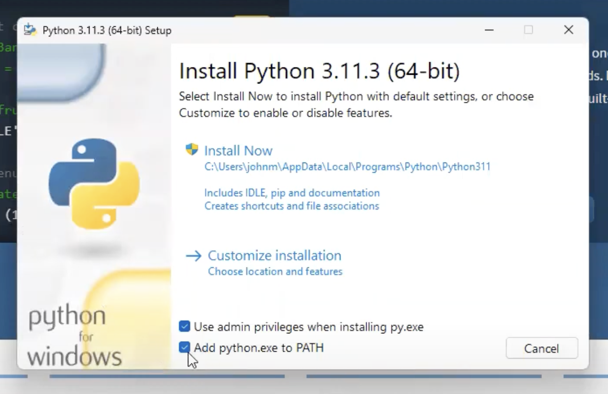

| [Introduction](../README.md) | [Step 1 - Run Your App for the First Time](../step1/step1.md) |
| - | - |

# Step 0 - Set Up Your Computer for Building Apps

### If you are using Mac or Windows:

Download and install the following:

- **Git** - [git-scm.com/downloads](https://git-scm.com/downloads)
- **Visual Studio Code** - [code.visualstudio.com](https://code.visualstudio.com)

### ONLY if you are using Windows:

- Install **Python** - [python.org](https://www.python.org/)
- Make sure you check the boxes where it says:
  - [x] Use admin privileges when installing py.exe
  - [x] Add python.exe to PATH

---

### Enable Auto Save

In order to prevent you from having to manually save the files every time you make a change, let's enable Auto Save so your changes will be saved automagically.

- Open Visual Studio Code
- Enable auto save by going to `File > Auto Save`

| [Introduction](../README.md) | [Step 1 - Run Your App for the First Time](../step1/step1.md) |
| - | - |
