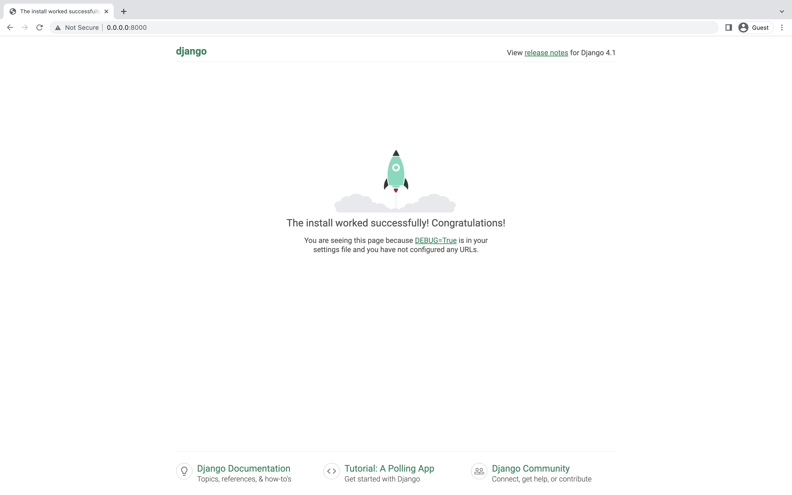

### Introduction

This workshop will walk you through building a to-do list app that does the following:

- Creates a to-do item
- Edits to-do item text
- Marks a to-do item as completed
- Deletes a to-do item

| [Step 0 - Set Up Your Computer for Building Apps](../step0/step0.md) | [Step 1 - Run Your App for the First Time](../step1/step1.md) |
| - | - |

# Step 1 - Run Your App for the First Time 

In a terminal window, run the following commands to download the project to your `Desktop` folder:

  ```bash
  cd ~/Desktop
  git clone https://github.com/andrewrobles/MyApp.git
  ```

- Open up the project in Visual Studio Code by going to `File > Open` and navigating to `~/Desktop/MyApp`
- Open up a terminal window by going to `View > Terminal`
- Depending on if you're using Mac or Windows, run the following command under the section of whichever type of computer you're using:
---

### If you are using a Mac:
```bash
python3 -m venv VirtualEnvironment 
```

### If you are using Windows:
```bash
python -m venv VirtualEnvironment 
```
---
- Run the following commands:
```bash
source VirtualEnvironment/bin/activate
pip install -r requirements.txt
python manage.py migrate
```
- Now this is where the magic happens... are you ready? Run the following command:
```bash
python manage.py runserver
```
- Open the URL in a browser window provided in the terminal output - http://127.0.0.1:8000
- You should see the following:
  

Congratulations, you're officially an app developer ;)

