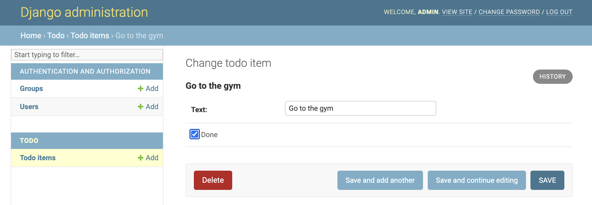
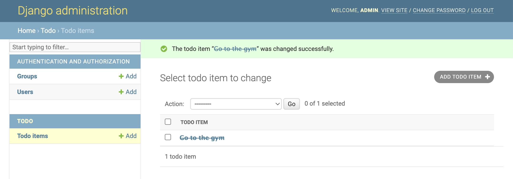

# Step 4 - Customize How Text is Displayed

Using the app, edit the to-do item and click on the checkbox to mark it as done.



Now, we are going to write some code so that any items marked as done are crossed out. Let’s update the contents of `MyApp/models.py` to:

```python
from django.db import models
from .utils import strike

class TodoItem(models.Model):
    text = models.CharField(max_length=200)
    done = models.BooleanField(default=False)

    def __str__(self):
        if self.done == True:
            return strike(self.text)
        else:
            return self.text
```

If you go back to your list of to-do items, you should see your item crossed out because it was marked as done.

